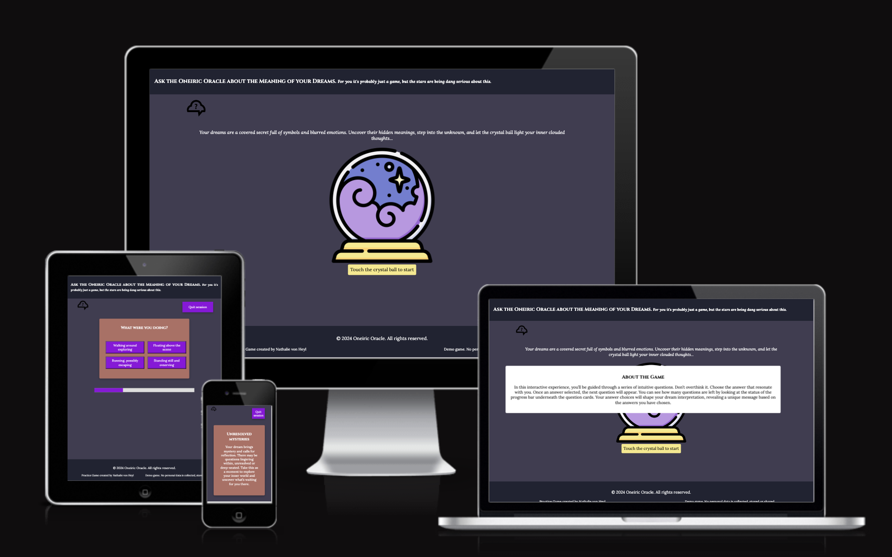
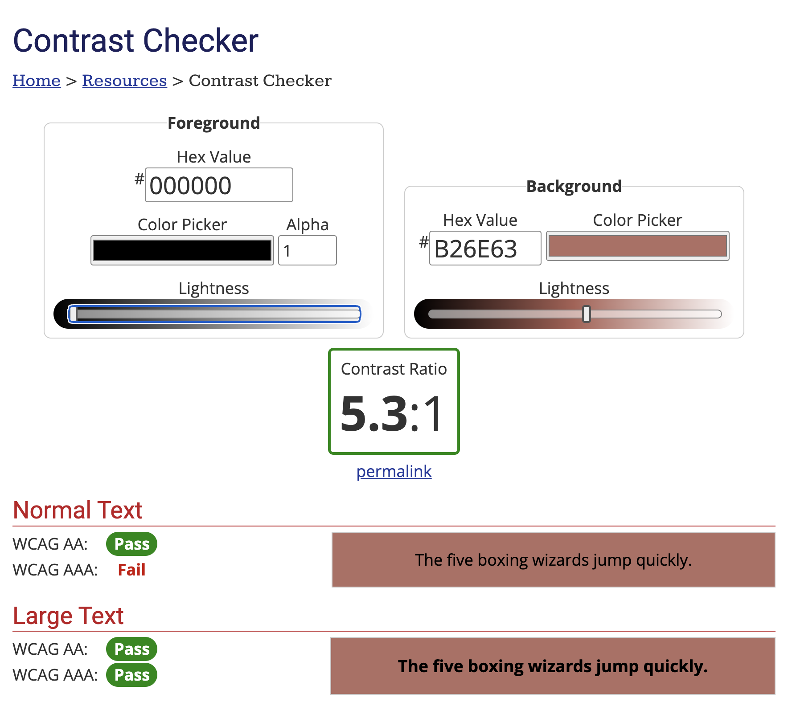
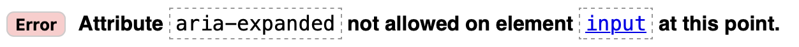
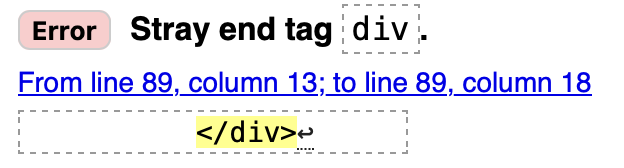
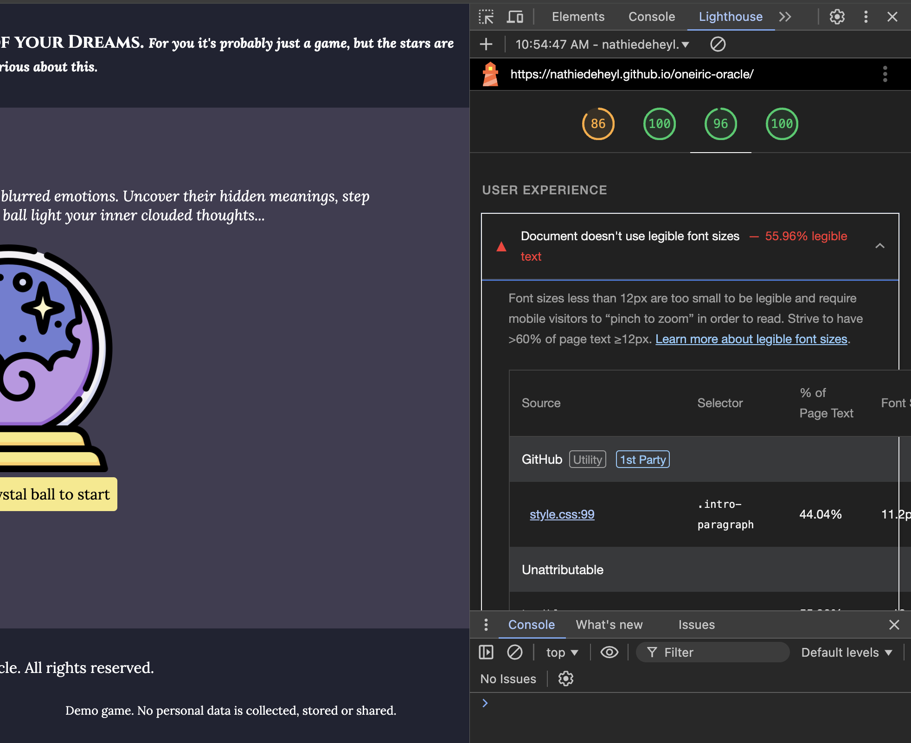
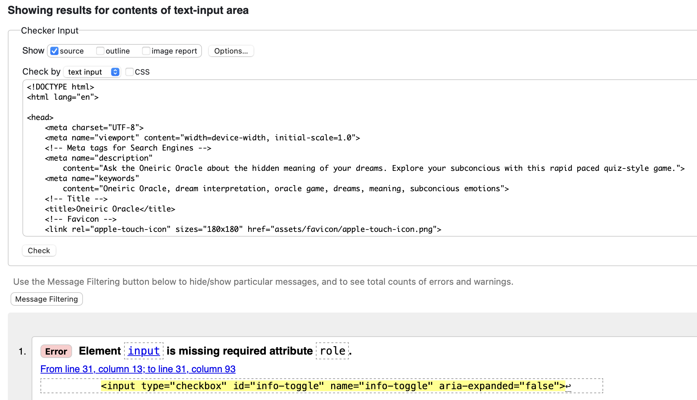
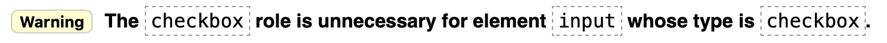

# Your sometimes friendly Oneiric Oracle
## For you it's probably just a game, but the stars are being very serious about this. 

[Preview the live site here](https://nathiedeheyl.github.io/oneiric-oracle/)

## General

### Project Description

This web-based project is an interactive experience that offers to interpret a user’s dream. Rather than complex text analysis, the user is presented with questions reflecting common symbols in dream interpretation. Those questions are designed to trigger the user’s intuition. The user is also encouraged to respond quickly without overthinking. By responding intuitively to the given prompts, the user receives a dream "interpretation" tailored to the answers they’ve selected before.  

The user answers 7 questions, with each answer corresponding to a different dream mood or concept. Each response option is assigned a specific value that adds up to a total score throughout the question session. After one answer has been selected by the user, the next question is displayed during question session. Based on the user's total score, they receive one of four possible dream interpretations.

Wireframes

Wireframes for Mobile Devices

Wireframes for Tablet Devices

Wireframes for Desktop

### Purpose of the Project

The Website "Oneiric Oracle" aims to provide the user with fun and light-hearted introduction to dream interpretation. Designed for users who are new to the world of dream interpretation, the project touches on common themes and symbols, without going too deep. The goal is to encourage reflection and give reassurance by validating the user's feelings and experiences while dreaming.  

Introspection is fostered by presenting the user with a series of questions based on typical dream symbols. The interpretations given in the end are blended with a little bit of humor, containing just enough insight to spark curiosity about what our dreams might reveal, without taking oneself too seriously. 

The initial version of the project focuses on providing an engaging experience. The long-term vision is to develop the website into a more nuanced tool, incorporating text inputs with language processing and accessing a wider range of interpretation. For now, the purpose of the project is to make users curious about the world of symbols, and to be a fun prompt to encourage reflection and introspection on thoughts and feelings.

## UX

### User Demographic

Generally speaking, the project is designed to appeal to a broad age range. The website and its game-like approach to dream interpretation is easily accessible to anyone interested and open to dream interpretation. However, the website targets mainly users who are beginners in the field of dream interpretation. The quiz-styled tool helps users who are curious about what their dream might mean, but who may not have any deeper knowledge about the topic or experience in dream interpretation yet. Target users are looking for a mix of entertainment and encouragement to self-reflect. 

### User Goals

- The user wants to explore the meaning of their dream. 
- The user is curious about the topic of dream interpretation and wants to get some insights about what symbols and themes mean according to the field of study. 
- The user wants to be entertained with a light-hearted game-like quiz. 

### User Expectations

- A responsive, accessible website on all devices (mobile, tablet, desktop).
- User-friendly and straightforward design with minimal steps to start the game. 
- Intuitive navigation that guides the user throughout the experience without distraction. 
- Interactive, clickable elements that make it easy to progress through the game. 
- A visible progress bar that helps track the position within the game. 
- A clear outcome at the end of the game: A unique dream interpretation based on the answers chosen. 
- If the user choses to start over, they expect the score and with in the progress bar to be reset. 

### User Stories

#### As a user ... 

- I want to explore the meaning of my dreams in a fun and interactive way. 
- I want to reflect on my subconscious thoughts and hidden feelings. 
- I want clear steps (no multiple choice, one question, one answer) to answer the questions. 
- I want a straightforward layout, so I can start the game easily and quickly. 
- I want to gain some insight into the meaning of my dream and get a feedback after answering all questions. 

#### As the site owner ... 

- I want user to return to the site thanks to it's engaging and game-like approach on the topic. 
- I want to encourage users to practice introspection. 
- I want to teach users to watch out for symbols and themes in their dreams. 

## Design

### Font Choices

For the **Oneiric Oracle** website, I chose two creative fonts to transport the mystic vibe of a fortune teller's tent: 

| Font  | Use               | Justification                                                                                                                                           |
|-------|------------------------|-------------------------------------------------------------------------------|
| Cinzel | Headings & Buttons | Mysterious, still elegant, fitting the vibe. |
| Lora   | Italic for body texts | For body text, I'm generally trying to go for a more subtle version that is easier to read to assure user-friendliness. The Lora font provides those aspects while still fitting the mystical vibe that Cinzel gives. |

The font-size is adjusted to occasionally be displayed slightly smaller on mobile screens to optimize the layout, ensuring a balanced appearance given the limited space on question cards and answer buttons, while always ensuring adaptability and accessability by using `rem` units for font sizing. This allows for better scaling according to the user's individual device settings. 

### Colors and Contrast

**Primary Colors**: https://coolors.co/202332-413d51-9102de-b26e63

The website https://coolors.co/ provides information about contrast ratio of their colors towards black or white text color. 

To meet the general vibe of the website, I mostly choose white colored text on darker backgrounds, but picked also a vibrant and a very rich color for a more playful element and to ensure good contrast. 

Changed the white text on `background-color: #B26E63;` to textcolor black to ensure color contrast: 

Screenshot from contrast checker website

## Features

- Start button in form of violet crystal ball img with label guiding user to click button to start the game 
- Toggle down info box 
- Text in info box is scrollable when text content is larger than info text box on screen 
- Quit session button to return to landing page layout 
- Quiz-style question cards with clickable answer buttons that lead to next question card being displayed 
- Question cards have a slightly flexible layout with a min-height to balance the design and layout of question cards and the text on them 
- Dynaic progress bar 

## Possible Future Features

- Customizable timer feature that jumps to next question after a given amount of time when user does not select an answer. The timer is reset with each new question displayed. The user should be able to switch off the timer feature before starting the game. The user will be prompted with an info text box once the timer runs out for the first time, explaining the feature one more time and pointing out the possibility of switching off the timer feature. The purpose of the timer feature will be to ensure the user answers the questions rapidly and intuitively without overthinking. 
- Make feedback shareable on social media with a brand design template for different media. 
- Dream log or diary in a personal user account 
- Replace keyword answer buttons with text input and use natural language processing and keyword recognition to generate a truly unique dream interpretation using API. 

## Languages

- HTML, CSS, JavaScript

## Technologies

- Google Fonts for typography
- Flaticon for icons 
- Favicon.io for converting icon to favicon 
- Coolors for generating the color palette
- WebAIM for contrast checking 

## Testing

### Validation of clickable elements

| Test  | Result  |
| ------| ------- |
| Toogle down info box link is working in all layout variations | ✅ |
| Start session button is working | ✅ |
| Quit session button leads back to landing page layout | ✅ | 
| All answer buttons are clickable and lead to expected feedback result | ✅ | 
| When a user attempts to acess any other page of the website they are redirected to the 404 page | ✅ | 
| The "back to main" link on 404 page works, has a text-decoration styling applied on mobile devices and a hover effect on larger screens | ✅ | 

### Responsiveness validation

| Test  | Result  |
| ------| ------- |
| Landing page layout, info text box toggle, start game icon, footer, quit session button, question session layout, progress bar and feedback layout display correctly on screens smaller than 768px | ✅ |
| Landing page layout, info text box toggle, start game icon, footer, quit session button, question session layout, progress bar and feedback layout display correctly on screens larger than 767px | ✅ | 
| Landing page layout, info text box toggle, start game icon, footer, quit session button, question session layout, progress bar and feedback layout display correctly on screens larger than 1024px | ✅ | 

Accessability validation: https://pagespeed.web.dev/analysis/https-nathiedeheyl-github-io-oneiric-oracle/kgevuq9ltr?form_factor=mobile 

### Code validation

| **Validation Issue**                                | **Screenshot**          | **Fix**                                                |
|-----------------------------------------------------|--------------------------|--------------------------------------------------------------|
| Attribute `aria-expanded` not valid at an early stage |  | Removed the attribute to avoid confusion while working on the project | 
| Stray end tag `div` after wrapping up last corrections to the html |  | Removed leftover stray elements from code. | 
| Lighthouse check on final version revealed an issue in User Experience |  | Adjusted font-size to ensure legible font-size for intro-paragraph | 

| Final code Validation  | Result  |
| ------| ------- |
| index.html | ✅ |
| 404.html | ✅ |
| style.css | ✅ | 
| script.js | ✅ | 
  
Validators used:  
html: https://validator.w3.org/nu/#textarea  
css: https://jigsaw.w3.org/css-validator/  
js: https://jshint.com  

### Bugs

| **Bug Description** | **Screenshot** | **Fix** | 
|-----------------------------------------------------|--------------------------|--------------------------------------------------------------|
| After a first validation when wrapping up the landing page html, the W3HTML validator pointed out an error indicating that `role="checkbox"` was missing for the `checkbox` `input` element. After adding `role="checkbox"` when validating the html code after setting up some basic html for the question sessions, I was prompted with the error: attribute `aria-checked` missing and role `checkbox` unnecessary at the same time. |   | After testing and researching, I came to the conclusion that both attributes are obsolete for the element `input type="checkbox` and removed both which resolved the validation issue. | 
| After an answer-button was clicked and the next question displayed, the corresponding text of the next answer option belonging to the type of answer-button was resized in its font-size. |  | The issue was a wrong application of hover effects on answer-buttons. Removing the hover effects solved the bug. |

## Deployment

The site was deployed using GitHub Pages. The steps to deploy are the following:

- In the [GitHub repository](https://github.com/nathiedeheyl/oneiric-oracle), navigate to the Settings tab.
- Under the heading "Code and automation", select "Pages".
- From the Build and deployment section Branch drop-down menu, select the **Main** Branch and the /root folder, then click "Save".
- Refresh the page. It should then say: "Your site was last deployed to the github-pages environment by the pages build and deployment workflow." and show the link to the live site on top of the page. 

[View the live site here](https://nathiedeheyl.github.io/oneiric-oracle/)

## Credits

### Media

- Favicon Emoji Source: <a href="https://www.flaticon.com/free-icons/crystal-ball" title="crystal ball icons">Crystal ball icons created by Freepik - Flaticon</a> 
- Flaticon Timer Emoji <a href="https://www.flaticon.com/free-icons/timer" title="timer icons">Timer icons created by Freepik - Flaticon</a>
- Flaticon cloud and question mark icon: <a href="https://www.flaticon.com/free-icons/question" title="question icons">Question icons created by Freepik - Flaticon</a>
- Favicon converter: https://favicon.io/favicon-converter/ 

### Resources

- Color palette: https://coolors.co/
- Contrast check: https://webaim.org/resources/contrastchecker/ 
- Fonts: https://fonts.google.com/
- Code Institute's Submissions repository: https://github.com/Code-Institute-Submissions/ 
- Research on elements, attributes, properties and functions, mainly using: https://developer.mozilla.org/ , https://www.w3schools.com/ , and https://stackoverflow.com/ or https://css-tricks.com/. 

## Acknowledgments 

I would like to thank my mentor, Rory Patrick Sheridan, for guiding me through the most difficult steps and always providing helpful insights. 